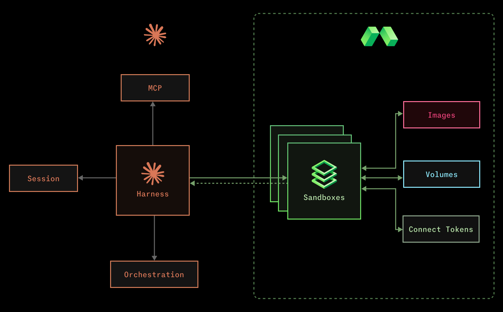

# Claude Managed Agents with Modal Sandboxes

<p align="center">
  
</p>

## Cookbook

### Main Ingredients

* [Claude Managed Agents](https://platform.claude.com/docs/en/managed-agents/overview)
    * Anthropic's remote agent harness that orchestrates long-running tasks and manages session state.
* [Modal Sandboxes](https://modal.com/docs/guide/sandboxes)
    * Secure and configurable containers for running untrusted or agent-generated code.

### Recipes

We have two self-contained and customizable examples for you to try:

* [Maude CLI](examples/basic)
    * A demonstration command line interface to talk with your remote and fully managed agent
* [Maude Slackbot](examples/slackbot)
    * A Slack app that maps Slack threads to Claude Managed Agent sessions

### What's the Story?

With Claude Managed Agents, you can now choose where agent code is executed. Modal Sandboxes offer many advantages here.

* Customizable [images](https://modal.com/docs/guide/images#images)
* Very fast [image rebuilds](https://modal.com/docs/guide/images#image-caching-and-rebuilds) that allow for more dev iterations
* Cost efficient due to the [burst pricing model](https://modal.com/docs/guide/resources#billing)
* Wait less with short Sandbox start times
* Complete control over [networking](https://modal.com/docs/guide/sandbox-networking)
* [Sandbox Connect Tokens](https://modal.com/docs/guide/sandbox-networking#connecting-to-sandboxes-with-http-and-websockets) for exposing servers securely
* Variety of persistence options
    * [Volumes](https://modal.com/docs/guide/sandbox-files#using-volumes)
    * [Directory Snapshots](https://modal.com/docs/guide/sandbox-snapshots#directory-snapshots-beta)
    * [Filesystem Snapshots](https://modal.com/docs/guide/sandbox-snapshots#filesystem-snapshots)
    * [Memory Snapshots](https://modal.com/docs/guide/sandbox-snapshots#memory-snapshots-alpha)
* Generous resource configurations
    * [GPUs](https://modal.com/docs/guide/gpu#specifying-gpu-type) (from L4s to B200s)
    * Greater than 16 CPUs
    * Greater than 64GB Memory
* Scalable to 100,000 concurrent Sandboxes and beyond!

### Code at a Glance

An `Image` is used to define the starting point for our Sandboxes.

```python
sandbox_image = (
    modal.Image.debian_slim(python_version="3.13")
    # add custom dependencies
    .apt_install("ffmpeg", "imagemagick", "mediainfo")
    .uv_sync()
    # add script to poll Anthropic's work queue
    .add_local_file("runner.py", "/root/runner.py", copy=True)
    .entrypoint(["python", "/root/runner.py"])
)
image_id = sandbox_image.build(app).object_id
```

A `Volume` is used to store data from the sessions, allowing us to easily resume.

```python
volume = (
    modal.Volume.from_name("claude-managed-agents", create_if_missing=True)
    .with_mount_options(sub_path=f"/sessions/{session_id}")
)
```

We reference both of these when creating our `Sandbox`, and add some extra configuration as required.

```python
sandbox = modal.Sandbox.create(
    image=modal.Image.from_id(image_id),
    volumes={"/workspace": volume},
    gpu="l4",  # if required
    timeout=60 * 60 * 24,
    idle_timeout=60 * 10,
    app=app,
)
```

Some use-cases need direct access to a server running inside the Sandbox. We can do this securely with `create_connect_token`, from which we can create a URL that is routed to port 8080 of the Sandbox.

```python
credentials = sandbox.create_connect_token()
secure_url = f"{credentials.url}/?_modal_connect_token={credentials.token}"
```
