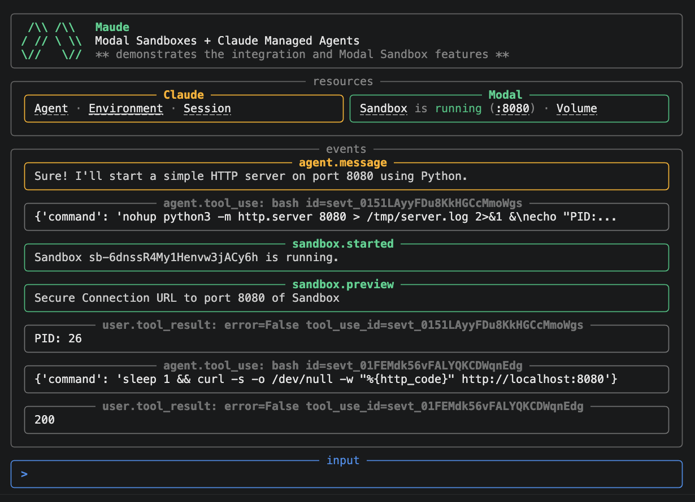

# Maude CLI

A remote coding agent that uses [Modal Sandboxes](https://modal.com/docs/guide/sandbox) as the execution environment for [Claude Managed Agents](https://docs.anthropic.com/en/docs/claude-code/managed-agents), which you can interact with via a demonstration CLI. Both the agent loop and the sandbox executions are all happening remotely to the machine running this CLI, so you can disconnect and continue the session at any time in the future.

<p align="center">
  
</p>

## Setup

### Preparation

* Copy the dotenv files

```bash
cd examples/cli
cp .env.example .env
cp .env.local.example .env.local
```

### Modal

* Set up [uv](https://docs.astral.sh/uv/)
* Set up the local venv: `uv sync`
* (Optional) Create and/or activate a Modal environment for this example.

```bash
uv run modal environment create claude-managed-agents
uv run modal config set-environment claude-managed-agents
```

* Build the sandbox image and deploy the webhook

```bash
make deploy
```

This runs `uv run modal run src/sandbox_image.py` (which builds the sandbox image and writes `SANDBOX_IMAGE_ID` into `.env`) and then `uv run modal deploy src/claude_webhook_handler.py`.

You should see something like this in your logs.

```
Created web function webhook => https://<workspace>-<environment>--<app>-<id>.modal.run
```

You should take note of this webhook URL, we'll need it later in the setup process.
Your webhook isn't fully functional yet. We'll do a redeploy later in the setup process.

### Claude

* Create and/or activate a non-default workspace in [Claude Platform](https://platform.claude.com). All the Claude resources should be created inside this workspace.

* Note your **Workspace ID**:
   * Open [Workspaces](https://platform.claude.com/settings/workspaces) and copy the ID for your workspace.
   * Or open any page inside your workspace in [Claude Platform](https://platform.claude.com), inspect the browser address bar, copy the segment after `/workspaces/` (looks like `wrkspc_...`)
   * Set `ANTHROPIC_WORKSPACE_ID` in `.env.local`. The CLI uses this to make
     the Claude Agent, Environment, and Session IDs clickable; if you omit it,
     everything still works but the links won't appear.

* Generate an **API key**
   * Call it 'Maude CLI'
   * Copy the key and set `ANTHROPIC_API_KEY` in `.env.local`

* Create an **Agent**
   * Choose blank agent template as the starting point
   * Set name as 'Maude CLI' in the YAML
   * Copy the ID (under the title) and set `ANTHROPIC_AGENT_ID` in `.env.local`

* Create an **Environment**:
   * Call it 'Maude CLI'
   * Choose 'Self-hosted' as hosting type
   * Copy the ID (under the title) and set `ANTHROPIC_ENVIRONMENT_ID` in `.env`

* Create an **Environment Key**:
   * Open the environment detail page
   * Click 'Generate Secret Key'
   * Call it 'Maude CLI'
   * Copy the key and set `ANTHROPIC_ENVIRONMENT_KEY` in `.env`

* Create a **Webhook**:
   * Use the URL contained within the `modal deploy` logs above
   * Set name as 'Maude CLI'
   * Subscribe only to `Session lifecycle -> Run started`.
   * Copy the secret and set `ANTHROPIC_WEBHOOK_SECRET` in `.env`, then deploy again.

* With all the .env variables updated, let's redeploy so our Modal app picks them up.

```bash
make deploy
```

## Usage

```bash
uv run maude
```

Just enter your prompt in the input box and then watch the stream of Claude and Modal Sandbox events.

> `uv sync` registers a `maude` console script (via `[project.scripts]` in
> `pyproject.toml`). If you activate the venv (`source .venv/bin/activate`)
> you can just run `maude` directly.

### Connect Tokens

Maude CLI creates a Sandbox Connect Token preview link for port 8080 by default when it sees a running
sandbox. Ask the agent to start a server on port 8080, and then click on the `:8080` link in the Modal resources panel on the top left.

```text
Start a Python HTTP server on port 8080 that serves a small HTML page with the current working directory and a timestamp.
```

Use the `--no-preview` flag to disable preview links.

### Resume

When you exit Maude CLI you should see a resume command printed (e.g. `Resume later: uv run maude --resume <session_id>`).
When you run this command, it will pre-populate the events saved in the Claude Managed Agent session.
